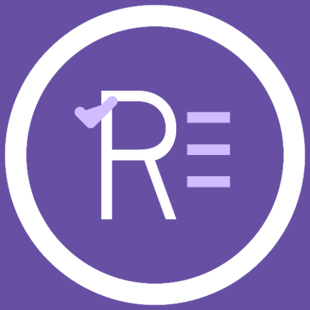
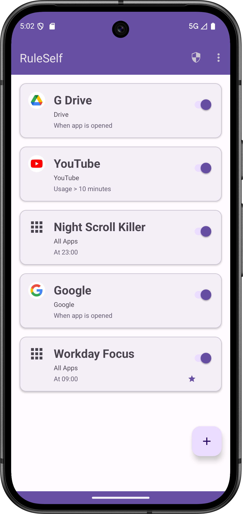
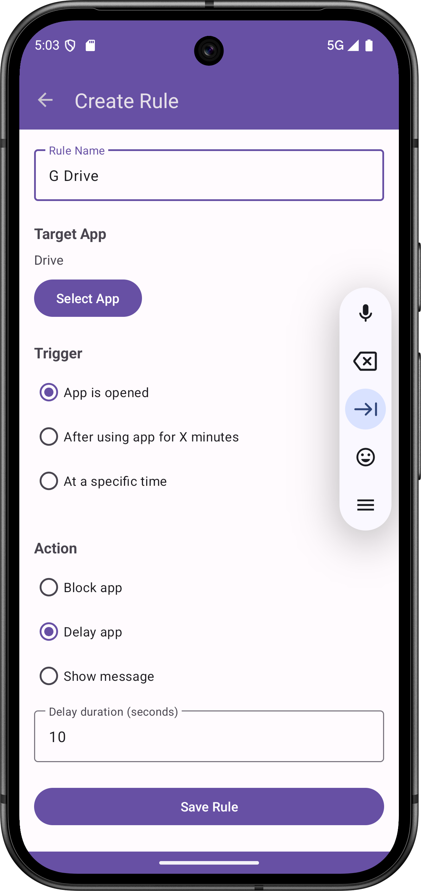
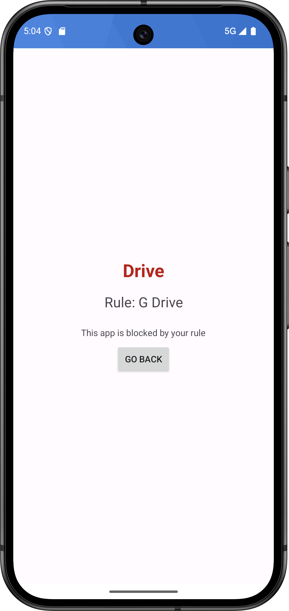
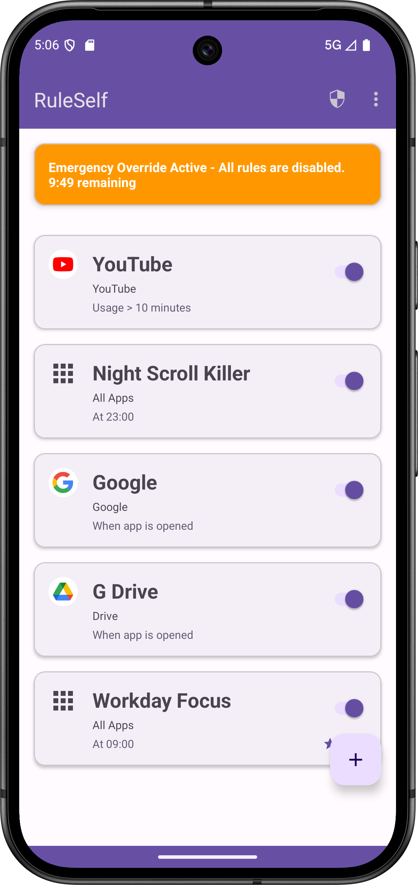
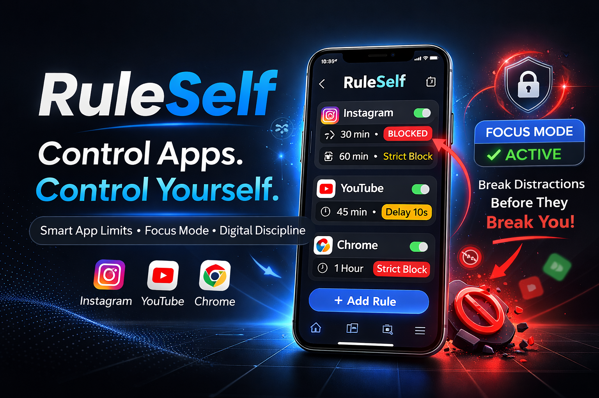

# 📘 RuleSelf — Self-Imposed Digital Discipline

  

<h1 align="center">RuleSelf</h1>

  <b>A Commitment-Based Digital Discipline System for Android</b>

  
  
  

---

# ✨ What is RuleSelf?

RuleSelf is a **self-binding digital discipline system** designed for individuals who want intentional control over their screen usage.

It is not a parental control app.
It is not just a timer.
It is not just an app blocker.

It is a system that allows you to **commit to your own rules — and honor them.**

> Discipline is strongest when it comes from within.

---

# 🧠 The Core Idea

Most screen time solutions operate on:

* Usage tracking
* Soft reminders
* Temporary restrictions
* Easy bypass options

RuleSelf operates on:

* Intentional rule creation
* Commitment locking
* Strong enforcement
* Long-term habit building

This shift changes everything.

---

# 🔄 How RuleSelf Works (Step-by-Step)

## 1️⃣ App Discovery

RuleSelf uses `QUERY_ALL_PACKAGES` to securely display the full list of installed apps on your device.

This enables:

* Selecting specific apps (Instagram, YouTube, etc.)
* Creating discipline rules for exact targets

No app usage data is uploaded. Everything stays local.

---

## 2️⃣ Rule Creation

Users define a rule with:

* Target App
* Time limit OR schedule window
* Activation condition
* Duration
* Commitment level

Example:

> "Block Instagram from 9 AM – 6 PM on weekdays."

---

## 3️⃣ Commitment Activation

Once activated:

* The rule becomes binding.
* It cannot be casually disabled.
* The system begins monitoring app foreground usage.

This is where RuleSelf differs from reminder-based apps.

---

## 4️⃣ Enforcement Engine

When a restricted app is opened during an active rule:

* RuleSelf intercepts via Accessibility monitoring.
* It immediately overlays or redirects.
* Access is denied until the rule expires.

No “15 more minutes” option.

No temporary bypass.

The rule stands.

---

## 5️⃣ Completion & Reset

When the rule period ends:

* Normal app access resumes.
* User can create a new rule.
* Discipline loop continues.

---

# 🛡 Enforcement Model

RuleSelf is built on a **strong commitment enforcement layer**:

| Layer                    | Purpose                      |
| ------------------------ | ---------------------------- |
| Accessibility Monitoring | Detect foreground app usage  |
| Foreground Service       | Maintain rule state          |
| Local Database           | Store rules securely         |
| Lock Overlay             | Enforce restriction visually |

All processing is local.

No external server dependency.

---

# 🔐 Privacy & Security

RuleSelf:

* Does NOT collect personal data
* Does NOT upload usage statistics
* Does NOT track browsing behavior
* Does NOT sell analytics

Permissions used strictly for:

* App visibility (rule creation)
* Foreground monitoring (enforcement)

User data remains on device.

---

# 🧠 Behavioral Psychology Foundation

RuleSelf leverages:

* Commitment Device Theory
* Self-binding behavioral economics principles
* Pre-commitment strategy models

Instead of relying on willpower in the moment,
you rely on decisions made in clarity.

---

# 🆚 Advanced Comparison

| Feature                    | RuleSelf         | Android Digital Wellbeing | Typical Blocker Apps |
| -------------------------- | ---------------- | ------------------------- | -------------------- |
| Self-Binding System        | ✅ Yes            | ❌ No                      | ❌ No                 |
| Easy Bypass                | ❌ No             | ✅ Yes                     | ⚠️ Often             |
| Designed for Adults        | ✅ Yes            | ⚠️ General                | ❌ Often Parental     |
| Psychology-Based           | ✅ Core Principle | ❌ No                      | ❌ No                 |
| App-Level Granularity      | ✅ Full           | ⚠️ Limited                | ⚠️ Limited           |
| Commitment Lock            | ✅ Yes            | ❌ No                      | ❌ Rare               |
| Data Privacy               | ✅ Fully Local    | ⚠️ System-level           | ⚠️ Varies            |
| Long-Term Discipline Model | ✅ Yes            | ❌ No                      | ❌ No                 |

---

# 📸 Screenshots

  
  
  
  

---

# 🎬 Feature Blue Print

  

---

# 🏗 Architecture Overview

* MVVM Pattern
* Repository Layer
* Room Database (local persistence)
* Android Accessibility Service
* Foreground Service enforcement

Clean separation of concerns.

Designed for scalability.

---

# 🎯 Who is RuleSelf For?

* Professionals seeking deep work
* Students preparing for exams
* Entrepreneurs reducing distractions
* Digital minimalists
* Anyone serious about self-discipline

---

# 🚀 Roadmap

* Advanced analytics dashboard
* Rule streak tracking
* Commitment intensity levels
* Exportable discipline reports
* Focus session mode
* Cloud backup (optional future)

---
