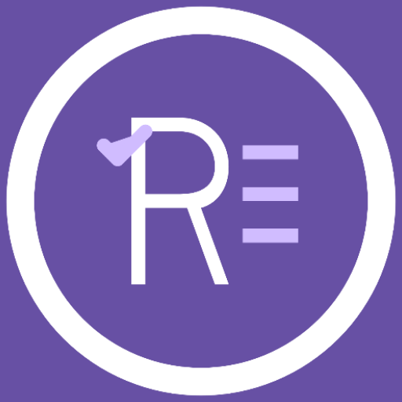
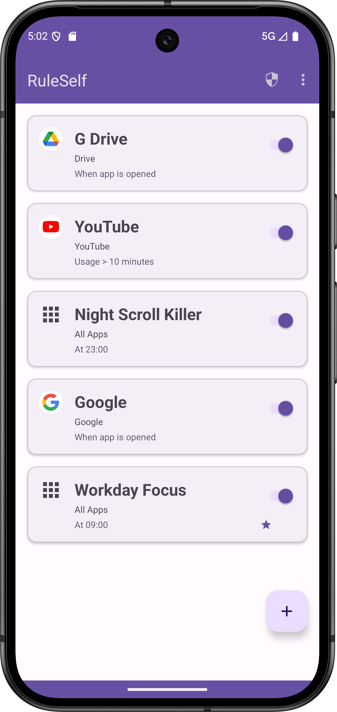
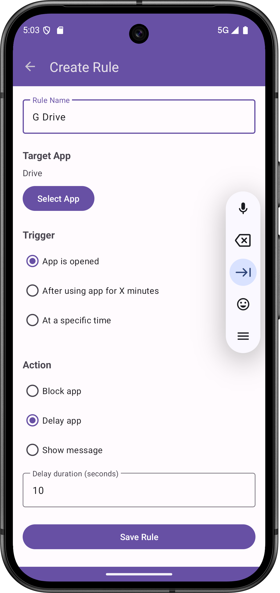
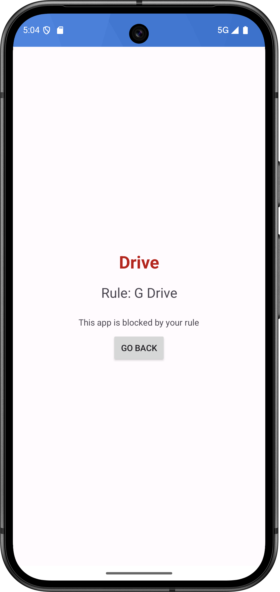
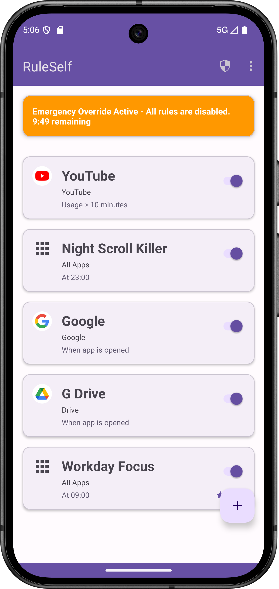
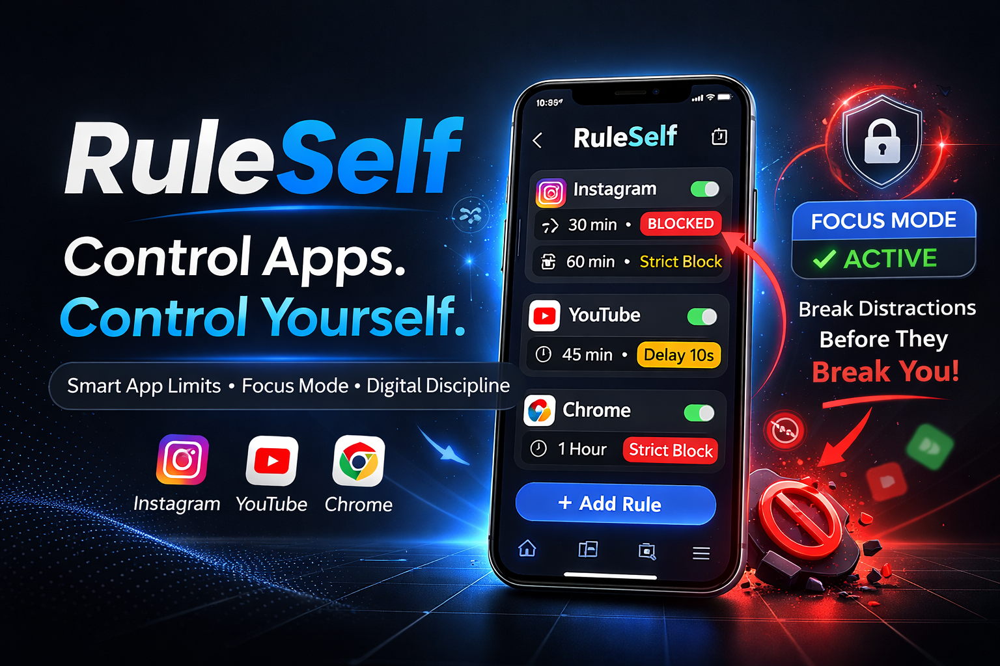

# 📘 RuleSelf — Self-Imposed Digital Discipline

  

<h1 align="center">RuleSelf</h1>

  <b>A Commitment-Based Digital Discipline System for Android</b>

  
  
  

---

# ✨ What is RuleSelf?

RuleSelf is a **self-binding digital discipline system** designed for individuals who want intentional control over their screen usage.

It is not a parental control app.
It is not just a timer.
It is not just an app blocker.

It is a system that allows you to **commit to your own rules — and honor them.**

> Discipline is strongest when it comes from within.

---

# 🧠 The Core Idea

Most screen time solutions operate on:

* Usage tracking
* Soft reminders
* Temporary restrictions
* Easy bypass options

RuleSelf operates on:

* Intentional rule creation
* Commitment locking
* Strong enforcement
* Long-term habit building

This shift changes everything.

---

# 🔄 How RuleSelf Works (Step-by-Step)

## 1️⃣ App Discovery

RuleSelf uses `QUERY_ALL_PACKAGES` to securely display the full list of installed apps on your device.

This enables:

* Selecting specific apps (social media, video apps, etc.)
* Creating discipline rules for exact targets

No app usage data is uploaded. Everything stays local.

---

## 2️⃣ Rule Creation

Users define a rule with:

* Target App
* Time limit OR schedule window
* Activation condition
* Duration
* Commitment level

Example:

> "Block a social media app from 9 AM – 6 PM on weekdays."

---

## 3️⃣ Commitment Activation

Once activated:

* The rule becomes binding.
* It cannot be casually disabled.
* The system begins monitoring app foreground usage.

This is where RuleSelf differs from reminder-based apps.

---

## 4️⃣ Enforcement Engine

When a restricted app is opened during an active rule:

* RuleSelf intercepts via Accessibility monitoring.
* It immediately overlays or redirects.
* Access is denied until the rule expires.

No “15 more minutes” option.

No temporary bypass.

The rule stands.

---

## 5️⃣ Completion & Reset

When the rule period ends:

* Normal app access resumes.
* User can create a new rule.
* Discipline loop continues.

---

# 🛡 Enforcement Model

RuleSelf is built on a **strong commitment enforcement layer**:

| Layer                    | Purpose                      |
| ------------------------ | ---------------------------- |
| Accessibility Monitoring | Detect foreground app usage  |
| Foreground Service       | Maintain rule state          |
| Local Database           | Store rules securely         |
| Lock Overlay             | Enforce restriction visually |

All processing is local.

No external server dependency.

---

# 🔐 Privacy & Security

RuleSelf:

* Does NOT collect personal data
* Does NOT upload usage statistics
* Does NOT track browsing behavior
* Does NOT sell analytics

Permissions used strictly for:

* App visibility (rule creation)
* Foreground monitoring (enforcement)

User data remains on device.

---

# 🧠 Behavioral Psychology Foundation

RuleSelf leverages:

* Commitment Device Theory
* Self-binding behavioral economics principles
* Pre-commitment strategy models

Instead of relying on willpower in the moment,
you rely on decisions made in clarity.

---

# 🆚 Why Not Just Use Built-in Screen Time Tools?

Every Android phone ships with built-in screen time tools. Device manufacturers layer their own variants on top. They all share the same fundamental design: **they ask you to resist temptation in the moment.**

RuleSelf takes the opposite approach: **you make the decision once, in a moment of clarity, and the system holds you to it.**

Here is exactly where they differ — and why it matters.

---

## The Bypass Problem

| Scenario | Built-in Screen Time Tools | RuleSelf |
|---|---|---|
| Timer runs out on an app | Tap **"OK"** → full access resumes instantly | Rule stays enforced — no override button |
| You want "just 5 more minutes" | **"Extend"** button appears | No extension mechanism exists |
| You disable the timer entirely | Open Settings → remove the timer (takes seconds) | Rules are commitment-locked — toggling requires deliberate action |
| You circumvent the limiter | Built-in limits are trivially removable from Settings | Foreground service keeps enforcement alive independently |

> Built-in tools treat limits as suggestions. RuleSelf treats them as commitments.

---

## Feature-by-Feature Comparison

| Capability | Built-in Screen Time Tools | OEM Screen Time Variants | RuleSelf |
|---|---|---|---|
| **Daily app timer** | Single per-app timer, resets at midnight | Similar | Per-app rules with custom schedules, day-of-week control, and time windows |
| **Schedule-based blocking** | None — timers only | Basic "Focus Mode" pauses select apps | Full schedule rules: block an app from 9 AM–6 PM on weekdays |
| **Bypass resistance** | One tap to dismiss | One tap to resume | No in-the-moment override; emergency mode requires deliberate activation with countdown |
| **Focus Profiles** | None | Basic mode toggle | Named profiles (Work, Study, Sleep) with independent rule sets, day/time windows, and one-tap switching |
| **Emergency override** | N/A — limits are already trivially removable | N/A | Structured emergency system: 10 min / until tomorrow / 24 hr, with automatic expiration and clear UI banner |
| **Per-app grouping** | Flat list | Flat list | Rules grouped by target app — bulk enable/disable entire groups at once |
| **Rule persistence** | Timer resets every midnight | Resets daily | Rules persist until you deliberately change them — no daily reset |
| **Privacy** | Usage data may be synced to cloud accounts | Varies by manufacturer | Fully local — no cloud sync, no analytics, no tracking |
| **Target audience** | General / Parental | General / Parental | Adults who want self-imposed discipline |
| **Psychology model** | Nudge theory (gentle reminders) | Same | Commitment device theory — decisions made in clarity, enforced in temptation |
| **Rule granularity** | One timer per app | One timer per app | Multiple rules per app (e.g., block during work hours AND limit to 30 min in the evening) |
| **Cross-app coordination** | No | No | Focus Profiles coordinate rules across multiple apps under a single time window |
| **Enforcement method** | System pops a dismissible dialog | Same | Foreground service intercepts and overlays — no dismissible dialog |

---

## The Core Difference

Built-in screen time tools are **reactive systems**. They count your usage, show you a number, and politely ask if you would like to stop. When the timer hits zero, they pop a dialog you can dismiss in one tap. Tomorrow, the counter resets, and the cycle repeats.

RuleSelf is a **proactive commitment system**. You define rules when you are thinking clearly — "Block video apps on weekdays during work hours" — and the system enforces them without asking for your permission in the moment. There is no bypass dialog. There is no "5 more minutes" button. The rule stands until its scheduled window ends.

This is the difference between a speed limit sign and a physical speed bump. One informs you. The other acts.

---

## When Built-in Tools are Enough

Built-in screen time tools work well if:

* You just want to **see** how much time you spend on apps
* A gentle reminder is enough to change your behavior
* You have strong in-the-moment willpower
* You only need basic daily timers

## When You Need RuleSelf

RuleSelf is built for you if:

* You find yourself dismissing built-in screen time timers regularly
* You need **schedule-based** rules (not just daily counters)
* You want to block specific apps during specific hours on specific days
* You want enforcement that does not rely on your willpower at 11 PM
* You manage different discipline modes (Work vs. Study vs. Sleep)
* You value privacy and want everything to stay on your device

---

# 📸 Screenshots

  
  
  
  

---

# 🎬 Feature Blue Print

  

---

# 🏗 Architecture Overview

* MVVM Pattern
* Repository Layer
* Room Database (local persistence)
* Android Accessibility Service
* Foreground Service enforcement

Clean separation of concerns.

Designed for scalability.

---

# 🎯 Who is RuleSelf For?

* Professionals seeking deep work
* Students preparing for exams
* Entrepreneurs reducing distractions
* Digital minimalists
* Anyone serious about self-discipline

---

# 🚀 Roadmap

* Advanced analytics dashboard
* Rule streak tracking
* Commitment intensity levels
* Exportable discipline reports
* Focus session mode
* Cloud backup (optional future)

---
